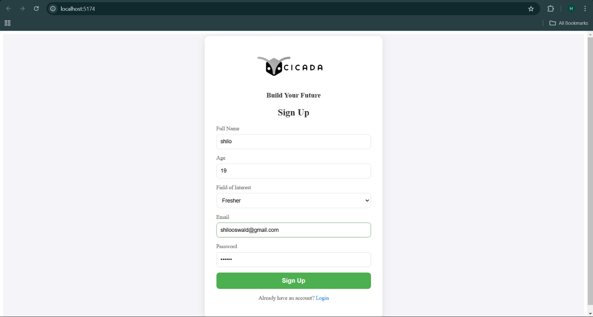
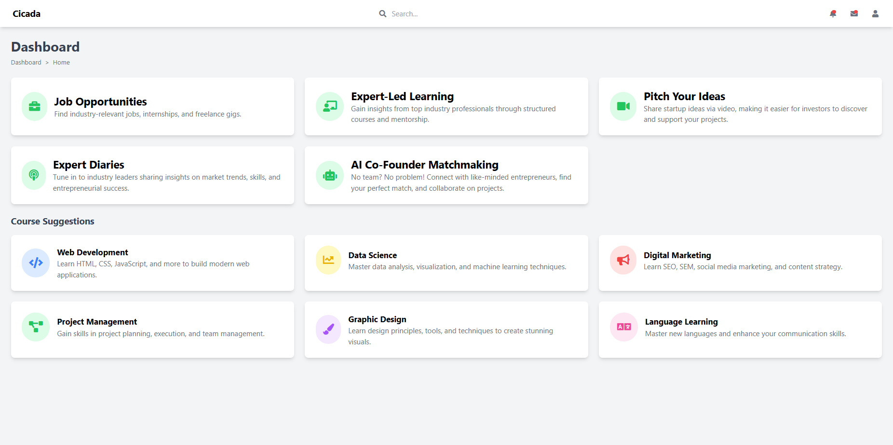
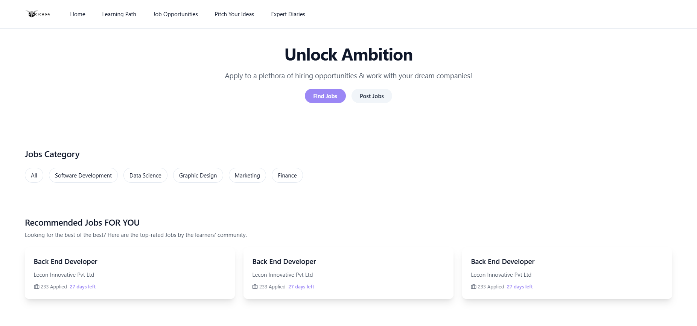
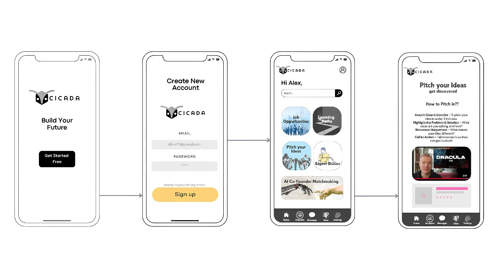

## Cicada - Your Network, Your Net worth

##### A versatile skill-mapping platform that:

* Evaluates job market dynamics
* Recommends tailored learning journeys
* Links users with industry experts
* Facilitates hands-on project learning
* Validates skills through practical mini-projects

## Problem Statement

#### Build solutions that empower entrepreneurs, equip graduates with essential skills, and drive innovation in key sectors for sustainable growth.

#### Focus on providing graduates with the resources and opportunities to excel in today’s competitive job market.

### Challenges
-----

Lack of verified skills-based hiring platforms

Employers struggle to assess real skills beyond resumes

Existing platforms lack micro interactions for engagement

### Why It Matters:
-----

The gap between skills and employment affects career growth and business
productivity.

## Solution Overview

Cicada is an AI-driven platform that connects
skilled individuals with job opportunities
based on verified skills and real-world
assessments.

### How It Works:
-----
Verified Skill Assessments

AI Career Matching

Video Pitch Opportunities

Investor Collaboration Channels

## Tech Stack

### **Frontend (React + Vite)**

- **Framework**: React 19
- **Build Tool**: Vite
- **State Management**: (Not specified, could use React Context or Redux)
- **Routing**: React Router
- **Charts & Visualization**: Chart.js, react-chartjs-2
- **Authentication**: jwt-decode
- **HTTP Requests**: Axios
- **Linting**: ESLint

### **Backend (Node.js + Express)**

- **Runtime**: Node.js
- **Framework**: Express.js
- **Authentication**: JSON Web Token (JWT), bcryptjs
- **Security & Middleware**: CORS, dotenv

## Prototype

### Get Started

### Dashboard

### Job Opportunities

### Learning Resources

## Responsive Design

## Our Solution

- Practical Skill-Building - Focus on hands-on
  projects over traditional passive learning.

- Pitch Your Ideas (Video) — Express yourself
  and pitch your ideas through engaging videos to
  attract potential investors.

- Industry Insight Channels (Podcast-Style) -
  Investors can create podcast-like video channels
  to share industry requirements and trends for a
  trillion-dollar economy.

#### 🚀 Continuous Improvement – Cicada is an evolving platform, and we are actively working on enhancing features, refining AI-driven skill assessments, and expanding industry collaborations to make it even more impactful. Stay tuned for updates!